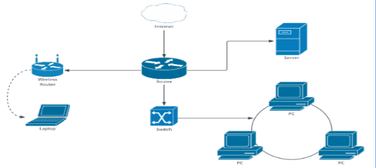

## **Networking**

Networking is the **interconnection of devices** (such as computers, printers, servers, and mobile devices) for the purpose of **data sharing, communication, and resource utilization**.

---
