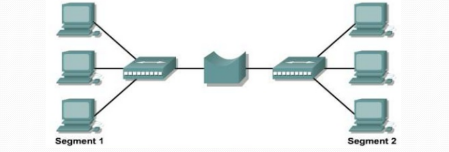

## **Bridge**

A **Bridge** is a networking device that connects two or more **Local Area Networks (LANs)** or segments, allowing them to function as a single network. It operates at the **Data Link Layer (Layer 2)** of the OSI model.

### **Functions & Characteristics**

1. **LAN Interconnection** – Connects multiple LAN segments to extend the network.
2. **Traffic Filtering** – Inspects incoming data frames and determines whether they should be forwarded, filtered, or blocked based on their **MAC address**.
3. **Collision Domain Reduction** – Divides the network into smaller collision domains, improving overall performance.
4. **Port Efficiency** – Reduces unnecessary traffic, making each network segment more efficient.
5. **Learning Capability** – Uses a MAC address table to learn which devices are connected to which ports.

---
