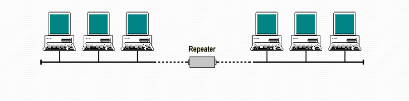

## **Repeater**

A **Repeater** is a network device used to **regenerate and amplify signals** in order to extend the distance a network can cover without data loss. It operates at the **Physical Layer (Layer 1)** of the OSI model.

### **Functions**

1. **Signal Amplification** – Boosts weakened signals to restore them to their original strength.
2. **Extends Network Range** – Allows data to travel farther over a network medium without degradation.
3. **Error Reduction** – Minimizes data corruption caused by signal loss over long distances.

### **Common Usage**

* Commonly used in **coaxial cable networks** and some fiber optic or wireless links.
* Typically, a **maximum of four repeaters** can be used in a single cable network segment to avoid excessive latency and signal distortion.

---