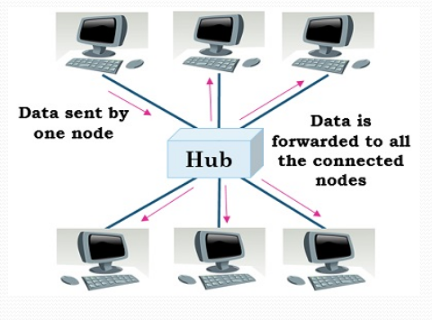

## **Hub**

A **Hub** is a basic networking device used to connect multiple devices within a **Local Area Network (LAN)**. It operates at the **Physical Layer (Layer 1)** of the OSI model and is often referred to as a **multiport repeater**.

### **Functions & Characteristics**

1. **Device Connectivity** – Connects multiple computers or network devices in a LAN.
2. **Multiport Repeater** – Regenerates signals received on one port and sends them to all other ports.
3. **Broadcast Transmission** – Sends data to all connected devices, regardless of the destination MAC address.
4. **Half-Duplex Communication** – Only one device can send data at a time; simultaneous transmissions cause collisions.
5. **Lower Data Speed** – Typically operates at **10 Mbps**.
6. **Collision Domain** – All devices connected to a hub share the same collision domain, leading to reduced performance in busy networks.

---
