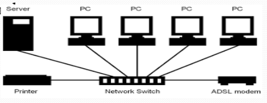

## **Switch**
cd

A **Switch** is a networking device used to connect multiple devices within a **Local Area Network (LAN)**. It operates at the **Data Link Layer (Layer 2)** of the OSI model, but some switches also function at the **Network Layer (Layer 3)** (known as Layer 3 switches). A switch is more efficient than a hub or bridge due to its intelligent traffic management.

### **Functions & Characteristics**

1. **Device Connectivity** – Connects multiple computers and network devices in a LAN.
2. **MAC Address Table** – Stores a list of MAC addresses along with their corresponding ports in its **RAM**.

   * MAC addresses are learned during the first broadcast from any port.
   * Subsequent communication is sent directly to the intended device without broadcasting.
3. **High-Speed Communication** – Provides faster data transfer rates compared to hubs and bridges; often referred to as an **intelligent hub**.
4. **Full-Duplex Operation** – Allows multiple devices to send and receive data simultaneously without collisions.
5. **Speed Support** – Commonly supports **10/100/1000 Mbps** (Fast Ethernet and Gigabit Ethernet).
6. **Collision Domain Reduction** – Each port on a switch represents its own collision domain, greatly improving network performance.

---
