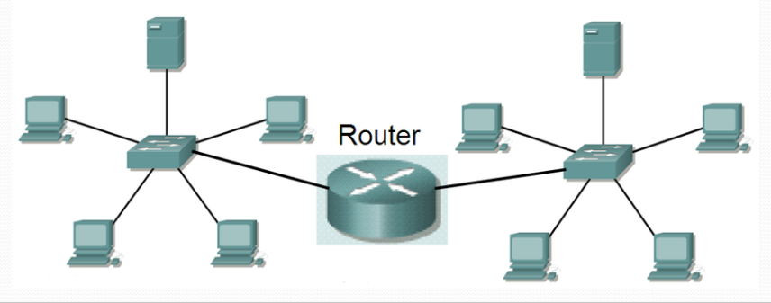

## **Router**

A **Router** is a networking device used to connect **multiple networks** and direct data packets between them. It operates at the **Network Layer (Layer 3)** of the OSI model and makes decisions based on **IP addresses**.

### **History & Manufacturers**

* The first commercial router was developed by **Cisco Systems** in **1984**.
* Today, many companies manufacture routers, including **Juniper**, **MikroTik**, **Huawei**, **TP-Link**, and **Netgear**.

### **Functions & Characteristics**

1. **Network Interconnection** – Connects different networks such as LAN to WAN or LAN to LAN.
2. **Broadcast Domain Separation** – Prevents unnecessary broadcast traffic between networks.
3. **Best Path Selection** – Uses **routing tables** and **routing protocols** to determine the most efficient path to a destination.
4. **Packet Forwarding** – Directs data packets toward their destination based on IP addresses.
5. **Packet Filtering** – Implements **Access Control Lists (ACLs)** and firewall features to control traffic.
6. **Protocol Support** – Can handle multiple protocols such as TCP/IP, OSPF, EIGRP, BGP, etc.

---

## **Internal Hardware of a Router**

Routers consist of several key hardware components that enable them to process, store, and forward data efficiently:

1. **Processor (CPU)** – Executes the router’s operating system (IOS) and manages routing functions.
2. **Motherboard** – The main circuit board that houses all essential components and connections.
3. **RAM (Random Access Memory)** –

   * Stores running configurations, routing tables, and packet buffers.
   * Data is erased when the router is powered off or restarted.
4. **NVRAM (Non-Volatile Random Access Memory)** –

   * Stores the startup configuration file.
   * Retains data even when the router is powered off.
5. **Flash Memory** –

   * Stores the **Cisco IOS** (Internetwork Operating System) and other system files.
   * Non-volatile, meaning data is retained after a reboot.

---

## **Interfaces of a Router**

Routers provide multiple interfaces for management, communication, and network connectivity:

1. **Console Port** – Used for local management and configuration via a direct serial connection.
2. **AUX (Auxiliary) Port** – Allows remote management via a modem connection.
3. **Ethernet / FastEthernet / GigabitEthernet Ports** – Network interfaces for LAN and WAN connectivity, supporting speeds of 10 Mbps, 100 Mbps, and 1 Gbps respectively.
4. **Serial / Smart Serial Ports** – Used for WAN connections (e.g., point-to-point links).
5. **SFP (Small Form-factor Pluggable) Slots** – Supports fiber optic or high-speed copper transceivers for scalable network connections.
6. **USB Ports** – Used for IOS upgrades, configuration file transfer, or additional storage.

---

