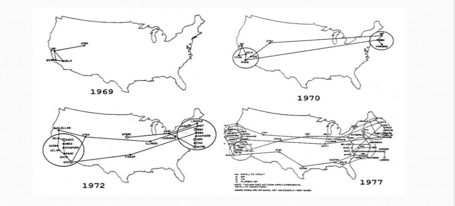

## **ARPANET (Advanced Research Projects Agency Network)**

ARPANET was the **first operational packet-switching network** and a precursor to the modern Internet.
It was developed in **1969** by the **United States Department of Defense’s Advanced Research Projects Agency (ARPA)** to enable secure and reliable communication between research institutions.

The initial ARPANET connected **four university computers**:

1. University of California, Los Angeles (UCLA)
2. Stanford Research Institute (SRI)
3. University of California, Santa Barbara (UCSB)
4. University of Utah

ARPANET introduced the concept of **packet switching**, which allowed data to be broken into packets, transmitted independently, and reassembled at the destination — a foundational principle still used in networking today.

